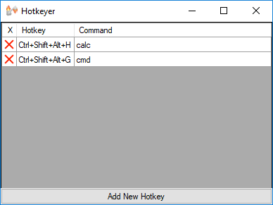

# HotkeyHelper
Dynamic, instant binding of global windows hotkeys to shell commands.

The UI is very simple, and at any moment the table always conforms to the hotkeys currently bound (no saving, loading, and other inconveniences).
The configuration is saved to a text file in the same path as the executable.

